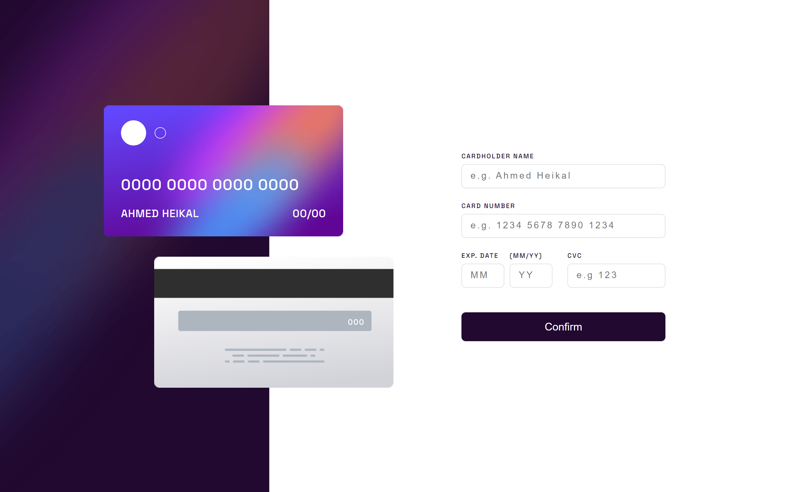

# Interactive card details form

This is a solution to the [Interactive card details form challenge on Frontend Mentor](https://www.frontendmentor.io/challenges/interactive-card-details-form-XpS8cKZDWw/hub). Frontend Mentor challenges help you improve your coding skills by building realistic projects.

## Overview


 ### Live Demo:
-  coming soon

### The challenge
Users should be able to:
- Fill in the form and see the card details update in real-time
- Receive error messages when the form is submitted if Any input field is empty, The card number, expiry date, or CVC fields are in the wrong format
- View the optimal layout depending on their device's screen size
- See hover, active, and focus states for interactive elements on the page 
 ---
## Build with

- React js 
- Redux & redux-toolkit
- HTML and CSS (Grid and Flex)


 
### How to use it
```bash
npm install redux react-redux
npm install @reduxjs/toolkit
npm start
```

## Screenshots





## License

[MIT](https://choosealicense.com/licenses/mit/)
